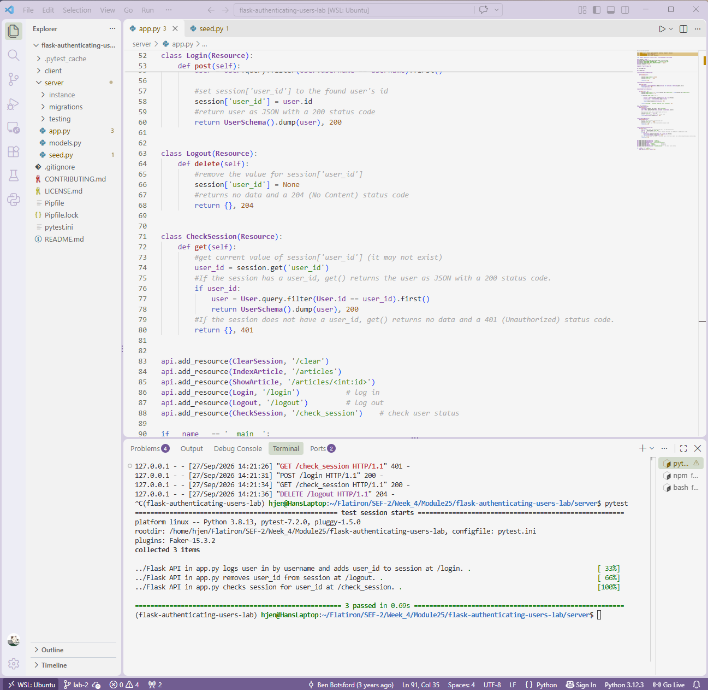

# Lab: Authenticating Users
**Completed Sept 27, 2026**

## Description

A full-stack blog application with a basic login feature, built with a Flask API
backend and a React frontend. Users can log in with their username, log out, and
stay logged in after refreshing the page, using Flask's `session` to persist the
logged-in user between requests.
 

 
## Features
 
- **Log in** by entering a username in a form. The server finds the user, stores
  their `id` in the session, and returns the user as JSON.
- **Log out**, which clears the user from the session.
- **Stay logged in** after a page refresh. On load, the React app asks the server
  whether a session exists and restores the logged-in user if it does.
  
## How It Works
 
HTTP is stateless, so the server needs a way to remember who is logged in between
requests. When a user logs in, the server saves their `user_id` in Flask's
`session`. Flask signs that data with the app's `secret_key` and sends it to the
browser as a cookie. The browser sends the cookie back with every later request,
which lets the server identify the user.
 
The React frontend proxies API requests to the Flask server (configured in
`client/package.json`), which avoids CORS issues and allows the session cookie to
be shared between the frontend and backend.
 
## API Endpoints
 
| Resource       | Method | Route            | Success Response           | Other Responses              |
| -------------- | ------ | ---------------- | -------------------------- | ---------------------------- |
| `Login`        | POST   | `/login`         | User JSON, `200 OK`        |                              |
| `Logout`       | DELETE | `/logout`        | No content, `204`          |                              |
| `CheckSession` | GET    | `/check_session` | User JSON, `200 OK`        | No content, `401 Unauthorized` if no one is logged in |
| `ClearSession` | DELETE | `/clear`         | No content, `204`          |                              |
| `IndexArticle` | GET    | `/articles`      | List of articles, `200 OK` |                              |
| `ShowArticle`  | GET    | `/articles/<id>` | Article JSON, `200 OK`     | `401` after 3 page views     |
 
Example login request body:
 
```json
{
  "username": "Thomas"
}
```
 
## Installation
 
Clone the repository, then from the project root run:
 
```bash
pipenv install && pipenv shell
npm install --prefix client
cd server
flask db upgrade
python seed.py
```
 
## Usage
 
Start the Flask server from the `server` directory:
 
```bash
python app.py
```
 
The API runs at `http://localhost:5555`.
 
In a second terminal, start the React frontend from the project root:
 
```bash
npm start --prefix client
```
 
The app opens at `http://localhost:4000`. Log in with any seeded username
(for example, `Thomas`). Usernames are case-sensitive.
 
To see all seeded usernames, run `flask shell` from the `server` directory and
enter `User.query.all()`.
 
## Running Tests
 
From the project root:
 
```bash
pytest
```
 
All tests pass.
 
## Project Structure
 
```
flask-authenticating-users-lab/
├── client/            # React frontend
├── server/
│   ├── app.py         # Flask app and API resources
│   ├── models.py      # SQLAlchemy models and marshmallow schemas
│   ├── seed.py        # Seeds the database with users and articles
│   └── migrations/    # Database migrations
├── Pipfile            # Python dependencies
└── pytest.ini         # Test configuration
```
 
## Technologies
 
- Python, Flask, Flask-RESTful, Flask-SQLAlchemy, Flask-Migrate
- marshmallow for serialization
- SQLite
- React
- pytest
## Known Limitations
 
- Authentication is by username only, with no passwords, so this is not suitable
  for production use.
- Logging in with a username that does not exist is not yet handled and causes a
  server error. A future improvement would return a `401` or `404` with an error
  message.